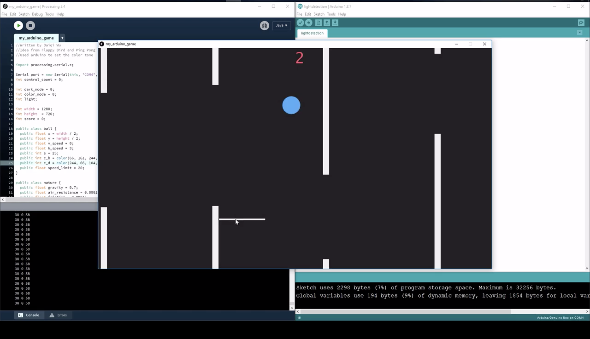
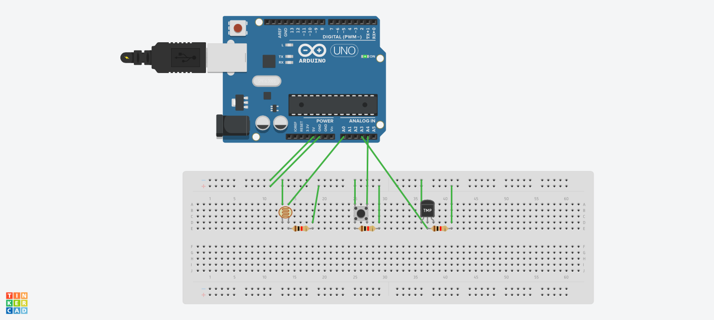

# COMP0002 C Coursework - Daiqi Wu

## Submit Information

Author : [Daiqi Wu](https://wudaiqi.com)

Tools Used: Arduino UNO, Processing Java

## Description
This Project is a game that combines the idea of Flappy Bird and the Pong Game. The objective of this game is to control a holder that bounces a ball through obstacles without colliding with the leftmost side of the game canvas. Arduino UNO is used to retriefve light intensity, button press, and temperature information such that the environment in the game will change accordingly. Processing IDE is used in Java mode on PC to run the game itself while communicating with Arduino UNO board.

## How to Use

### Step 1
Download Arduino IDE and Processing IDE, connect Arduino UNO to PC / mac  with sensors connected on the breadboard to the Arduino. See below for the circuit diagram:

### Step 2
Upload the Arduino Code at `/lightdetection/lightdetection.ino` to the UNO board. Check Serial Port output to `COM4` with `9600 braud`.

### Step 3
Run Processing Java Code at `/my_arduino_game/my_arduino_game.pde`. Done!

## References

Flappy Bird, developed by Dong Nguyen and dotGears, 2013

Pong, developed by Atari, Inc., 1972

